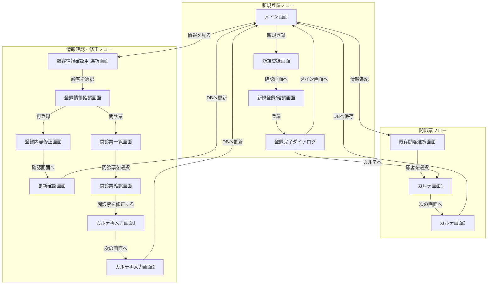

# Questionnaire - 整体師用問診票アプリ

これは、紙媒体で管理されていた問診票をDX化するために制作したAndroidアプリです。顧客情報と問診内容をデジタルで管理し、Google Driveへのバックアップ・復元機能を備えています。

## 目次
- [プロジェクトの背景](#プロジェクトの背景)
- [主な機能](#主な機能)
- [使用技術](#使用技術)
- [セットアップ方法](#セットアップ方法)
- [アプリの使い方](#アプリの使い方)
- [こだわった点](#こだわった点)
- [ER図・画面遷移図](#er図画面遷移図)
- [いただいたFBと今後の展望](#いただいたfbと今後の展望)
- [詳細資料(説明書)](#詳細資料)

## プロジェクトの背景
私の父は個人で整体師を営んでおり、紙媒体の問診票が100枚以上に達していました 。この業務をDX化し、管理を効率化するために本アプリを開発しました。

### Androidアプリである理由
開発にあたり、初期費用とランニングコストを最小限に抑えることを重視しました。Androidタブレットは1万円程度から購入可能であり、個人開発でコストを最も抑えられる選択肢だと考え、Androidでの開発を選択しました。

## 主な機能
- **新規顧客登録機能**: 新しいお客様の個人情報を登録します。
- **問診票（カルテ）追記機能**: 既存のお客様の問診内容を記録します。
- **顧客情報・問診内容の確認機能**: 登録された情報を一覧で確認・検索できます。
- **Google Driveへのバックアップ・復元機能**: 端末の故障や買い替えに備え、全データをGoogle Driveに安全に保存・復元できます。

## 使用技術
- **言語**: Kotlin
- **UI**: Android View System (XML)
- **アーキテクチャ**: Activity-Based (各画面をActivityとして実装)
- **非同期処理**: Kotlin Coroutines
- **API通信**:
  - Google Drive API (OAuth 2.0)
  - Google Auth Library for Android
- **JSONパース**: Gson
- **データベース**: SQLite (SQLiteOpenHelper)

- ## セットアップ方法
1. このリポジトリをクローンします。
2. Android Studioでプロジェクトを開きます。
3. **Google Drive APIのセットアップ**
   Google Driveへのバックアップ機能を利用するには、以下の手順でOAuth 2.0クライアントIDを設定する必要があります。
   - Google Cloud Platformでプロジェクトを作成し、**Google Drive APIを有効化**します。
   - **OAuth 2.0 クライアント IDを作成**します。
     - **パッケージ名**: `build.gradle.kts`に記載されている`namespace`を指定します。
     - **SHA-1 証明書フィンガープリント**: Android Studioのターミナルで `./gradlew signingReport` を実行して取得したキーを設定します。
   - 作成したプロジェクトの「OAuth同意画面」で、ご自身のGoogleアカウントを**テストユーザーとして追加**します。
4. **インターネット権限の確認**
  `AndroidManifest.xml`に`<uses-permission android:name="android.permission.INTERNET" />`が含まれていることを確認します。
5. Android Studioでビルドして実行します。

## アプリの使い方

1. メイン画面

- **新規登録**: 新しいお客様の情報を入力する画面（新規登録画面）へ遷移します。
- **情報追記**: 既存のお客様を選択し、問診票を記入する画面（既存顧客選択画面）へ遷移します。
- **情報を見る**: 登録されているお客様の情報を確認する画面（顧客情報確認用選択画面）へ遷移します。
- **GoogleDriveに保存/取得ボタン**: 全データをGoogle Driveへバックアップ、または復元します。

2. 新規登録画面

お客様の個人情報を入力します。

- **クリア**: 入力項目をすべてリセットします。
- **確認画面へ**: 入力内容を確認する画面（登録内容確認画面）へ遷移します。

3. 登録内容確認画面

新規登録、または情報更新時に入力した内容の最終確認を行います。

- **登録/更新**: 入力内容をデータベースに保存します。保存後、問診票を続けて入力するか、トップ画面に戻るかを選択するダイアログが表示されます。
- **キャンセル**: 入力内容を破棄し、前の画面に戻ります。

3.5. 登録完了フラグメント

- **トップ画面へ戻る**
保存し、トップに戻る場合はこのボタンを押下(メイン画面に遷移)

- **カルテへ**
保存した情報を持って、カルテ画面にそのまま移動(カルテ画面に遷移)

4. 既存顧客選択画面 (情報追記)

メイン画面の「情報追記」から遷移します。問診票を記入したいお客様を一覧から選択します。フリガナやIDで検索することも可能です。

5. カルテ画面 (問診票入力)

お客様の症状などをヒアリングしながら入力します。すべての必須項目を入力すると「次の画面へ」ボタンが押せるようになります。

6. カルテ画面2 (免責事項)

免責事項を確認後、同意のチェックボックスにチェックを入れると「確認画面へ」ボタンが押せるようになります。

7. 顧客情報確認用選択画面 (情報を見る)

メイン画面の「情報を見る」から遷移します。登録されているお客様の一覧が表示されます。確認したいお客様を選択すると、登録情報確認画面へ遷移します。

8. 登録情報確認画面

選択したお客様の登録情報が表示されます。

- **再登録**: 情報を修正するための画面（登録内容修正画面）へ遷移します。
- **戻る**: 前の選択画面に戻ります。
- **問診票**: このお客様の過去の問診票一覧画面へ遷移します。

9. 登録内容修正画面

  
既存の顧客情報が入力された状態で表示されます。内容を修正し、「確認画面へ」ボタンを押すと、更新内容確認画面へ遷移します。

10. 更新内容確認画面

  
修正した登録内容が表示されます。修正内容が正されていることを確認し、「更新する」ボタンを押すと、内容が更新されメイン画面へ遷移します。

11. カルテ一覧画面

  
特定のお客様の、過去の問診票が日付順に一覧表示されます。確認したい問診票をタップすると、その詳細画面へ遷移します。

12. カルテ内容確認画面

 
選択した問診票に前回登録した内容を確認できます。

- **問診票を修正する**: 内容を修正するための画面(カルテ再入力画面)へ遷移します。

13. カルテ再入力画面

  
選択した問診票の詳細について書いてあります。前回入力された項目が入力された状態で表示されます。

- **次の画面へ**: 内容を修正するための画面（カルテ2再入力画面）へ遷移します。

14. カルテ2再入力画面

  
前画面での修正内容を確認し、同意にチェックを入れると、問診内容が更新されます。

15. Google Drive 保存・取得

「GoogleDriveに保存」または「GoogleDriveから取得」ボタンを押すと、Googleアカウントの選択画面が表示されます。アカウントを選択して認証を行うことで、データのバックアップ・復元が実行されます。

## こだわった点
このプロジェクトでは、**いかにお金をかけずにDX化を実現するか**にこだわりました。
- **低コストなハードウェア**: 安価なAndroidタブレットで運用できるよう設計しました。
- **サーバーレスなデータ管理**: Google Drive APIを利用することで、有料の外部データベースやサーバーを契約せずにデータバックアップを実現しました。
- **直感的なUI**: 父がPC操作に不慣れなため、直感的に使えるボタン名やレイアウトを意識しました。
- **継続的な開発**: 夏休みの1ヶ月間、毎日開発を続けることで、継続的な開発スキルを証明しました。

## ER図・画面遷移図
### ER図

### 画面遷移図
Mermaidを使った画面遷移図

## いただいたFBと今後の展望
実務でご活躍されているAndroidエンジニアの方から頂いたフィードバックを元に、以下の項目を修正・改善していきます  
- [x] **READMEの作成** :ReadMEをしっかり作らないと説明書だけでは作成過程などをしっかり見てもらえない可能性がある。  
- [x] **ファイル構造の見やすさ** :ファイル構造が画面ごとにまとまっていないため、この作品を見た人が理解しずらい、見るときに見づらいなどの可能性がある。  
- [ ] **Jetpack Composeへの対応** :授業で習ったやり方でこのアプリ開発を行っていたが、授業で習った内容が古い内容であり、現在の主流となっているUI手法として、Jetpack Composeが主流であるため、今風に変える必要がある。  (先に親に提供するため親が使用し始めて安定してきたタイミングで変更しようと考えています。)  
- [ ] **今後の学習課題**: 今回はAndroid View Systemで開発しましたが、現在の主流であるJetpack ComposeでのUI構築スキルや、最新の技術、主流を習得するため、簡単なアプリ作成などを通して学習を進めます。  現在練習中のGitHubリポジトリ(https://github.com/PANAKA-4696/PracticeToDoApp)

## 製作者
田中 潮音 (Shion Tanaka)

---

## 詳細資料

このプロジェクトに関するより詳細な情報（画面ごとの詳しい使い方、API設定の背景など）は、以下の説明書にまとめてあります。
情報の追記頻度が遅めのためverが違うことがありますご了承ください。

[➡️ Questionnaire説明書はこちら](https://docs.google.com/presentation/d/1xqYt9AdNYIFBNOu1SfC3jbIsnh-Z6TQV/edit?usp=drive_link&ouid=100060518070943536625&rtpof=true&sd=true)

Jetpack Comporseを使うためのToDoアプリを作成しました。今後このToDoアプリでの開発を活かしてこのアプリをアップデートしていこうと考えておりますので見ていただけると良いと思います。  
[➡️ Jetpack Comporseを使ったToDoアプリはこちら](https://github.com/PANAKA-4696/PracticeToDoApp)
